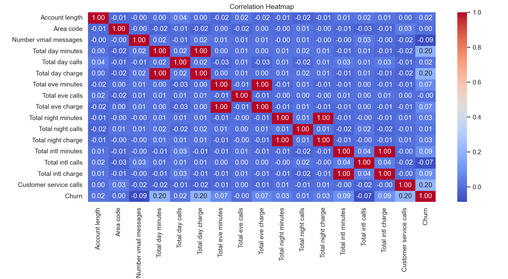
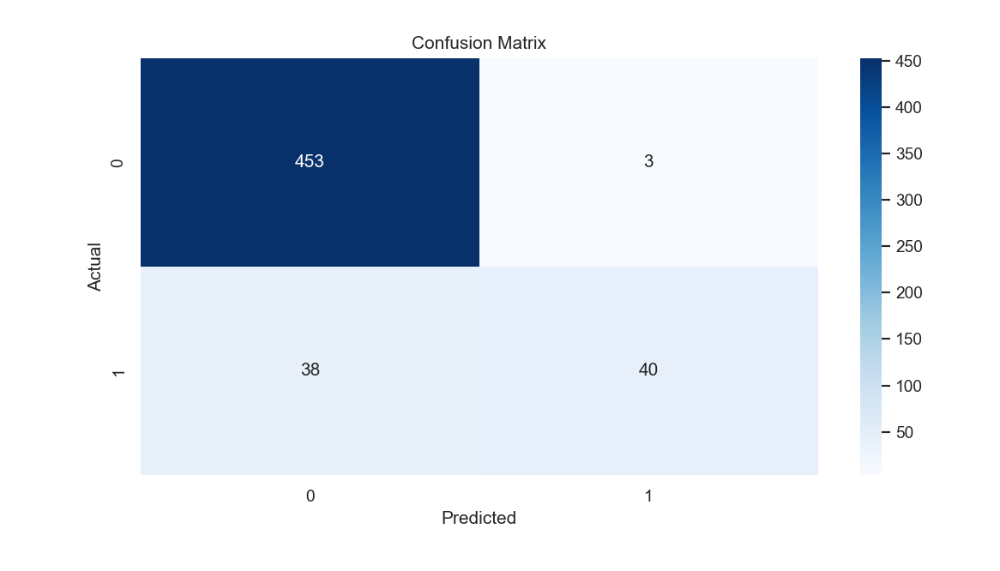
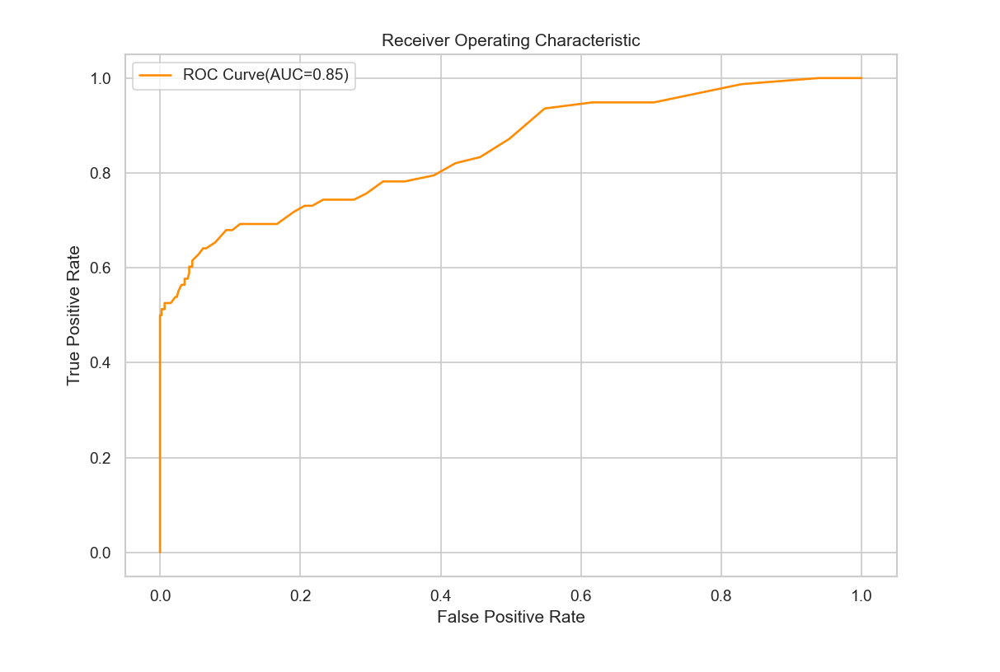
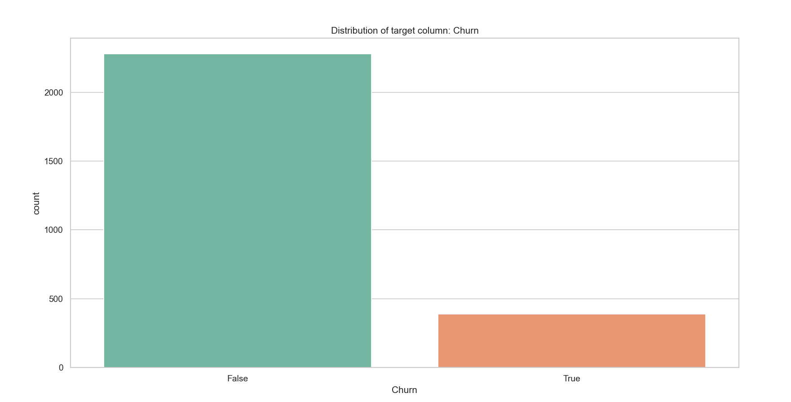
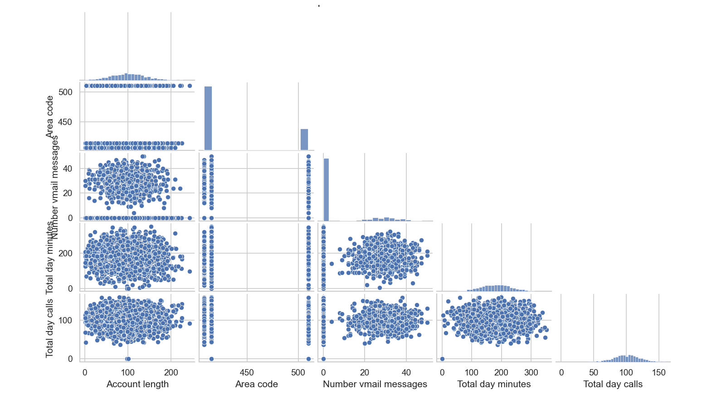

# 🧠 Customer Churn Prediction Web App

Welcome to the **Customer Churn Prediction App**! This interactive Streamlit web application predicts whether a customer will churn based on input data, using a trained **Logistic Regression model**. It also includes data visualizations to understand churn trends.

🔗 **Live App:** [Click here to open the app](https://churninsight-customer-churn-prediction-app-9tanflewkrnsz33tcpn.streamlit.app/)  
📊 **Dataset Used:** Cleaned version of the [Telcom Churn Dataset](https://www.kaggle.com/datasets/mnassrib/telecom-churn-datasets)

---

## 🖼️ Screenshots

### 📍 Home Page

---

### 🔍 Correlation Heatmap
Shows how features are correlated with churn.

---

### 🔢 Confusion Matrix
Evaluates the model’s prediction accuracy.

---

### 📈 ROC Curve
Visualizes the trade-off between sensitivity and specificity.

---

### 📊 Count Plot of Churn
Distribution of churned vs. retained customers.

---

### 🔁 Pairplot
Pairwise relationships of features and churn.

---

## 🧠 Features

- Upload your CSV dataset and get churn predictions
- Visual insights: heatmap, pairplot, confusion matrix, ROC curve
- Clean UI using Streamlit
- Efficient backend with Logistic Regression

---

## ⚙️ Tech Stack

- Python 🐍
- Streamlit 🎈
- scikit-learn 🔍
- Pandas 📘
- Matplotlib & Seaborn 📊
- Joblib 💾

---

## Author 

AARUSHI BISHT
BTech CSE (AI/ML)
[LinkedIn](www.linkedin.com/in/aarushi-bisht-b08508231)
[Github](https://github.com/aarushibisht01)